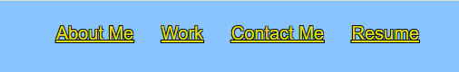
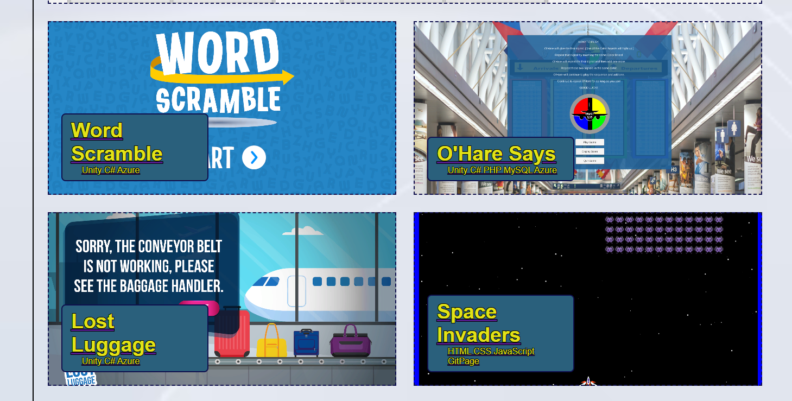
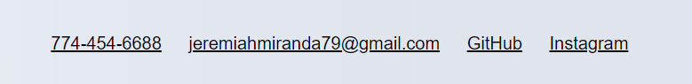

# Jeremiahs Portfolio

## Description

A short description explaining what the project will do.

- This project is to showcase my work to potential clients or employers.
- I wanted a place to put all of my projects so that they are accessable to anyone who wants to test or view them.
- It uses links to directly test the projects, along with some information about myself such as my familylife, education, passions, and past experiences.
- I have also included tools that I use to build applications.
- Finally I give the user access to different ways to contact me. 

## Simple Installation

Simpily follow this  link to view my portfolio. https://jeremiahmiranda79.github.io/Jeremiah-s-Portfolio/

## Usage

You can use the navigation bar to find the information your most interested in.

Click on the project picture to try out the applications.

Use the footer to find out how to contact me directly.

## License

N/A

## Development

This project was created using Visual Code, HTML, CSS, GitHub, and JavaScript.

## How to Contribute

Currently this project is closed for contribution.

# Thank you
I appreciate your interest in my projects!